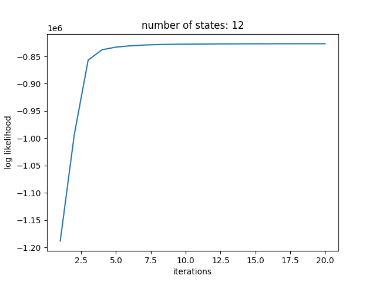
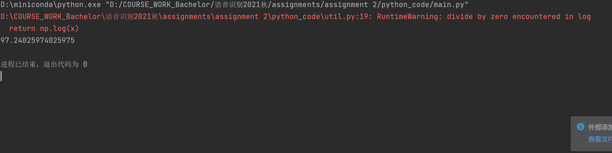

# Document of Assignment 2

**译事三难：信，达，雅**

​                                               ——严复

[TOC]

## I. Translation from MATLAB to Python

I really do not think we should have a deep understanding of HMM while doing this assignment as the deadline is near and it is very slow for my PC to train an HMM model as no GPUs is equipped. so I chose to translate line by line from MATLAB to Python. Below I will show some grammatical differences between MATLAB and python with some file format choosing problems while saving the MFCC feature, HMM model and file lists

1. **index of an array**

There are many code segments that traverse an array(mostly 2-D) like below:

```matlab
for k=1:num_of_model
	for j=1:num_of_state + 1
		...
	end
end
```

The most awful thing is the index while translating, the code above shall be translated as:

```python
for k in range(num_of_model):
    for j in range(num_of_state+1);
    	...
```

We can see that there are 2 differences:

​	(1) the index starts with 1 in MATLAB

​	(2) the range-like for loop in MATLAB will step into the right bound but Python won't

That results in 2 'magical' translation rules: 

​	(1) the left bound shall be taken 1 from the original one(in the example it is 1 in MATLAB and 0(omitted) in Python)

​	(2) the right bound keeps its original value because Python won't step into that loop.


2. **index of 3-D arrays**

With the difference in 1, the index of 3-D arrays still have another difference on what the index stands for:

​	**in MATLAB**: notation a(i,j,k) stands for the entry of **row i, column j and page k** of a 3-D array

​	**in Python**: notation a[i,j,k] stands for the entry of **page i, row j, column k** of a 3-D array

so a(i,j,k) in MATLAB is equivalent to a[k,i,j] in Python... , which is a little bit weird.


3. **The choice of file format**

In the original project, the author chose HTK feature file(.mfc) to store the MFCC feature and MATLAB file(.mat) to store the HMM model and the training & testing file lists. For convenience, I chose the library `pickle` to serialize the MFCC feature and the HMM model and the `csv` file format to store the training & testing lists. They are convenient file formats for python to read and write.


4. **Others**

I also abandoned some unnecessary data in the MATLAB code. I used my own mfcc API rather than the API in Python library as the Python API is unreliable on feature extracting

## II. Brief process to train an HMM model

The training code to train an HMM model is mainly in `EM_HMM.py` and `EM_HMM_training.py` . The algorithm is mainly based on the calculation of conditional probability. The function invoking chain is as below:

```
EM_HMM_training()    train an HMM model by an iteration of 20 times by updating the mean, variance,emossion 					 matrix
|            |
v            |
EM_HMM()     |        get the numerators and denominator for conditional probability training
             |
             v
   			initial_EM()    initialize the EM process
   			 |
   			 v
   			initial_HMM()   inintialize the HMM process
```


## III. Brief process to predicate a digit from an HMM model

The predicate algorithm is mainly Viterbi Alg and the brief process is as below:

	1. initialize the table
	1. fill in the table by the previous state using the formula in the PPT slide
	1. backtrace all the table to find the possible state

in this code, step 3 is useless because we don't need to know the chain of optimization. Just the final optimized value is enough

## IV. Test the code

Because it is so slow for the PC without GPU so I just tested the case with the number of state is 12.

**The likelihood diagram during the iteration:**



 **The accuracy rate of state 12**



It is somehow bit of lower(97.24%) than the MATLAB code.

I am more than happy to train my own ASR model by translating the  code. At least I have some experience in AI coding

## Appendix

### 1. How to run

1. run the `wav2mfcc.py`. script to get the MFCC feature
2. create a directory named `csvfiles` in the root directory of your project(storing the file lists)
3. create a directory named `HMM_model` in the root directory of your project(storing the HMM model)
4. run `wav2mfcc` to generate mfcc(.pkl) files
5. run `generate_*_list.py`(2 scripts should both be run) to generate file sheets
4. run `main.py` to do the ASR jobs

### 2. Pre-requisites

numpy  

pickle
